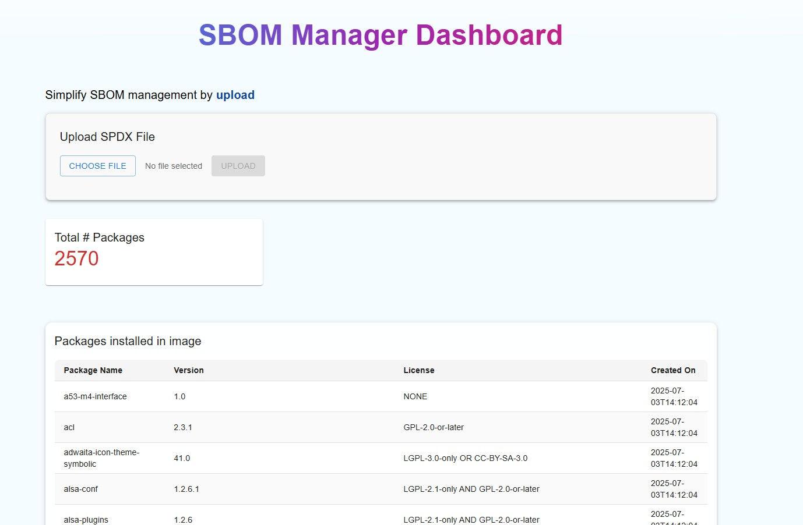

# 🛡️ SBOM visualizer

A sleek and interactive web dashboard for managing Software Bill of Materials (SBOM). Upload SBOM files, analyze package metadata, and track license summaries — all in a visual and user-friendly interface.



---

## 🚀 Features

- 📤 **Upload SBOM files** (CycloneDX format recommended)
- 📦 **View package metadata**: name, version, license
- 📊 **Summary cards** for quick license insights
- 🧠 **Typewriting effect** for enhanced UI engagement
- 🌈 **Gradient UI styling** and smooth animations
- 📁 **Backend integration** via REST API (assumes FastAPI or similar)

---

## 🧰 Tech Stack

- **Frontend**: React, Material UI (MUI)
- **HTTP Client**: Axios
- **Styling**: CSS, MUI `sx`, gradient text effects
- **Backend (external)**: Connects to a REST API (e.g. Python FastAPI)

---

## 📦 Installation

```bash
# Clone the repository
git clone https://github.com/prashantdivate/SBOM-visualizer.git
cd SBOM-visualizer

#Install the python dependencies
pip install fastapi uvicorn python-multipart zstandard

# build the project
docker-compose up --build

# launch the backend and frontend in web browser
http://localhost:3000
```
---
🤝 Contributing
Pull requests are welcome! For major changes, please open an issue first to discuss what you’d like to change.

1. Fork the project

2. Create your feature branch

3. Commit your changes

4. Push to the branch

5. Open a pull request
---
